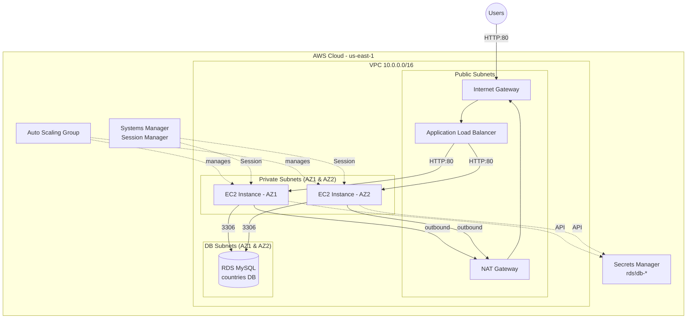

# Design Document: AWS Final Project

## Overview

This design describes a secure, scalable, and highly available three-tier PHP web application infrastructure on AWS, deployed entirely via Terraform. The architecture hosts a PHP application serving global development statistics from a MySQL database, with automatic scaling, load balancing, and defense-in-depth security.

The system follows a classic three-tier architecture:
- **Presentation tier**: Application Load Balancer in public subnets
- **Application tier**: EC2 instances in private subnets (via Auto Scaling Group)
- **Data tier**: RDS MySQL in dedicated database subnets

All resources are provisioned in `us-east-1` using Terraform, complying with AWS Academy Learner Lab constraints.

## Architecture

### High-Level Architecture Diagram



### Network Flow

1. Users send HTTP requests to the ALB via the Internet Gateway
2. ALB distributes traffic to healthy EC2 instances in private subnets
3. EC2 instances query RDS MySQL for data, retrieving credentials from Secrets Manager
4. EC2 instances access the internet (for package installs, app download) via NAT Gateway
5. Administrators access EC2 instances via SSM Session Manager (no SSH)

### Subnet Layout

| Subnet Type | AZ1 (us-east-1a) | AZ2 (us-east-1b) | Purpose |
|---|---|---|---|
| Public | 10.0.1.0/24 | 10.0.2.0/24 | ALB, NAT Gateway |
| Private | 10.0.3.0/24 | 10.0.4.0/24 | EC2 application instances |
| DB | 10.0.5.0/24 | 10.0.6.0/24 | RDS MySQL |

## Components and Interfaces

### 1. VPC and Networking

**Purpose**: Provides network isolation and segmentation following defense-in-depth principles.

**Configuration**:
- VPC CIDR: `10.0.0.0/16` (65,536 addresses — more than sufficient)
- 6 subnets: 2 public, 2 private, 2 DB across 2 AZs
- 1 Internet Gateway for public internet access
- 1 NAT Gateway in a public subnet for private subnet outbound access
- 3 route tables: public (→ IGW), private (→ NAT), DB (local only)

**Terraform Resources**:
- `aws_vpc`
- `aws_subnet` (×6)
- `aws_internet_gateway`
- `aws_nat_gateway` + `aws_eip`
- `aws_route_table` (×3) + `aws_route_table_association` (×6)

**Design Decision — Single NAT Gateway**: A single NAT Gateway is used instead of one per AZ. This reduces cost (~$32/month savings) at the expense of cross-AZ traffic charges and a single point of failure for outbound internet. For a lab environment with budget constraints, this tradeoff is acceptable. In production, one NAT Gateway per AZ would be recommended.

**Design Decision — /24 Subnets**: Each subnet uses a /24 CIDR (251 usable IPs), which is more than sufficient for this workload and leaves room for growth within the /16 VPC.

---

### 2. Security Groups

**Purpose**: Enforce three-tier network isolation at the instance level.

**Configuration**:

| Security Group | Inbound Rules | Outbound Rules |
|---|---|---|
| ALB SG | TCP 80 from 0.0.0.0/0 | All traffic (to EC2 SG) |
| EC2 SG | TCP 80 from ALB SG only | All traffic (NAT, RDS, Secrets Manager) |
| RDS SG | TCP 3306 from EC2 SG only | None required |

**Key Constraints**:
- No port 22 (SSH) on any security group — SSM is used instead
- Each tier only accepts traffic from its adjacent tier
- ALB SG is the only group exposed to the internet

**Terraform Resources**:
- `aws_security_group` (×3)
- `aws_security_group_rule` or inline rules

---

### 3. IAM Role and Instance Profile

**Purpose**: Grant EC2 instances least-privilege access to AWS services without storing credentials on disk.

**Configuration**:
- IAM Role with `ec2.amazonaws.com` trust policy
- Attached policies:
  - `AmazonSSMManagedInstanceCore` (managed policy) — enables Session Manager
  - Custom inline policy for Secrets Manager `GetSecretValue` and `ListSecrets`
  - Custom inline policy for RDS `DescribeDBInstances`
- Instance Profile wrapping the role, referenced in Launch Template

**Terraform Resources**:
- `aws_iam_role`
- `aws_iam_role_policy_attachment` (SSM managed policy)
- `aws_iam_role_policy` (inline for Secrets Manager + RDS describe)
- `aws_iam_instance_profile`

**Design Decision — Inline vs Managed Policies**: The SSM policy is AWS-managed (standard practice). The Secrets Manager and RDS describe permissions use inline policies scoped to the specific resources, following least-privilege principles.

---

### 4. RDS MySQL

**Purpose**: Managed MySQL database storing the `countries` database with `countrydata_final` table (214 rows of global development statistics).

**Configuration**:
- Engine: MySQL 8.0
- Instance class: `db.t3.micro` (lab budget constraint)
- Database name: `countries` (hardcoded in PHP app — non-negotiable)
- Storage: 20 GB gp2
- Multi-AZ: No (single instance — lab constraint, Requirement 16.5)
- Publicly accessible: No
- Manage master credentials in Secrets Manager: Yes (generates `rds!db-` prefix)
- DB subnet group spanning 2 AZs
- Deletion protection: Disabled (lab environment)
- Skip final snapshot: True (lab environment)

**Terraform Resources**:
- `aws_db_instance`
- `aws_db_subnet_group`

**Design Decision — Single RDS Instance**: The PHP application code uses `DBInstances[0]` to find the endpoint. Only one RDS instance must exist in the account. Multi-AZ is not enabled to reduce cost, though the subnet group spans 2 AZs for compliance.

**Design Decision — Managed Credentials**: The PHP `get-parameters.php` filters secrets by the `rds!` prefix. Using RDS-managed credentials (not a manually created secret) is mandatory for the application to function.

---

### 5. Secrets Manager

**Purpose**: Securely stores and provides database credentials to the PHP application without hardcoding.

**Configuration**:
- Secret is automatically created by RDS when `manage_master_user_password = true`
- Secret name will have prefix `rds!db-` (RDS-managed, not user-configurable)
- No manual `aws_secretsmanager_secret` resource needed
- EC2 instances retrieve credentials via AWS CLI/SDK using IAM permissions

**Credential Flow**:
1. RDS creates and manages the secret automatically
2. EC2 instance calls `aws secretsmanager list-secrets --filters Key=name,Values=rds!`
3. EC2 instance calls `aws secretsmanager get-secret-value` to get username/password
4. PHP application uses credentials to connect to RDS

**Terraform Resources**:
- None explicitly — RDS manages the secret via `manage_master_user_password = true`

---

### 6. Application Load Balancer

**Purpose**: Distributes incoming HTTP traffic across healthy EC2 instances for high availability.

**Configuration**:
- Type: Application (Layer 7)
- Scheme: Internet-facing
- Subnets: Both public subnets (cross-AZ)
- Listener: HTTP port 80, forward to target group
- Target Group:
  - Protocol: HTTP, Port 80
  - Target type: instance
  - Health check: HTTP GET `/` with 200 expected response
  - Health check interval: 30s, threshold: 3 healthy / 2 unhealthy
- No HTTPS (lab constraint)

**Terraform Resources**:
- `aws_lb`
- `aws_lb_target_group`
- `aws_lb_listener`

**Design Decision — Health Check Path**: Using `/` as the health check path verifies that Apache is running and serving the PHP application. A dedicated `/health` endpoint would be better in production but adds complexity beyond the lab scope.

---

### 7. Launch Template

**Purpose**: Defines the EC2 instance configuration for all ASG-launched instances.

**Configuration**:
- AMI: Amazon Linux 2023 (latest, looked up via `aws_ami` data source)
- Instance type: `t2.micro` (lab budget constraint)
- Network: No public IP assignment (`associate_public_ip_address = false`)
- Security group: EC2 SG
- IAM instance profile: The role with SSM + Secrets Manager permissions
- User data: Bootstrap script (templatefile with RDS endpoint variable)
- No SSH key pair (SSM-only access)

**Terraform Resources**:
- `aws_launch_template`
- `data.aws_ami` (Amazon Linux 2023 lookup)

---

### 8. Auto Scaling Group

**Purpose**: Maintains desired capacity of web servers, replaces unhealthy instances, and scales based on demand.

**Configuration**:
- Min capacity: 2
- Max capacity: 4
- Desired capacity: 2
- VPC zone identifier: Both private subnets
- Health check type: ELB (uses ALB health checks)
- Health check grace period: 300 seconds (time for user data to complete)
- Target group attachment: ALB target group ARN
- Target tracking scaling policy: Average CPU utilization at 50%

**Terraform Resources**:
- `aws_autoscaling_group`
- `aws_autoscaling_policy` (target tracking)
- `aws_autoscaling_attachment` (or inline `target_group_arns`)

**Design Decision — Min 2 Instances**: Ensures at least one instance per AZ for high availability. Even if one AZ has issues, the application remains available.

**Design Decision — 300s Grace Period**: The user data script installs packages, downloads the app, applies the bug fix, and starts Apache. This takes approximately 2-3 minutes. A 300-second grace period prevents premature termination of instances still bootstrapping.

---

### 9. User Data Script (userdata.sh.tpl)

**Purpose**: Bootstraps each EC2 instance to be a fully functional web server on first launch.

**Bootstrap Sequence**:

```bash
#!/bin/bash -xe

# 1. Install dependencies
dnf update -y
dnf install -y httpd php php-mysqli mariadb105

# 2. Download and extract application
wget -O /tmp/Example.zip https://aws-tc-largeobjects.s3.us-west-2.amazonaws.com/CUR-TF-200-ACACAD-3-113230/22-lab-Capstone-project/s3/Example.zip
unzip -o /tmp/Example.zip -d /var/www/html/

# 3. Fix lifeexpectancy.php bug (line 6: replace $_SESSION vars with direct vars)
sed -i 's/\$_SESSION\["ep"\]/\$ep/g; s/\$_SESSION\["un"\]/\$un/g; s/\$_SESSION\["pw"\]/\$pw/g; s/\$_SESSION\["db"\]/\$db/g' /var/www/html/lifeexpectancy.php

# 4. Start and enable Apache
systemctl start httpd
systemctl enable httpd
```

**Design Decision — sed for Bug Fix**: Using `sed` is simple, idempotent, and works reliably in user data. It replaces all `$_SESSION["xx"]` references with the direct variable equivalents (`$ep`, `$un`, `$pw`, `$db`). This ensures every instance launched by the ASG (including replacements) has the fix applied.

**Design Decision — No SQL Import in User Data**: The SQL import is intentionally NOT included in user data because:
1. RDS may not be ready when the first instance launches (race condition)
2. Multiple instances would attempt the import simultaneously
3. It's a one-time operation, not needed on every instance launch
4. SSM Session Manager provides a clean manual path

---

### 10. SQL Import Process

**Purpose**: One-time manual operation to populate the `countries` database with 214 country records.

**Process** (executed via SSM Session Manager on any EC2 instance):

```bash
# Download the SQL dump
wget https://aws-tc-largeobjects.s3.us-west-2.amazonaws.com/CUR-TF-200-ACACAD-3-113230/22-lab-Capstone-project/s3/Countrydatadump.sql

# Retrieve credentials from Secrets Manager
SECRET_ARN=$(aws secretsmanager list-secrets --filters Key=name,Values=rds! --query "SecretList[0].ARN" --output text)
SECRET=$(aws secretsmanager get-secret-value --secret-id $SECRET_ARN --query SecretString --output text)
USER=$(echo $SECRET | python3 -c "import json,sys; print(json.load(sys.stdin)['username'])")
PWD=$(echo $SECRET | python3 -c "import json,sys; print(json.load(sys.stdin)['password'])")

# Get RDS endpoint
RDS_HOST=$(aws rds describe-db-instances --query "DBInstances[0].Endpoint.Address" --output text)

# Import data
mysql -h $RDS_HOST -u $USER -p$PWD countries < Countrydatadump.sql

# Verify (should return 214)
mysql -h $RDS_HOST -u $USER -p$PWD countries -e "SELECT COUNT(*) FROM countrydata_final;"
```

This script will be provided in Terraform outputs for administrator convenience.

## Data Models

### Database Schema

**Database**: `countries`
**Table**: `countrydata_final`

The table is created by the SQL dump and contains development statistics for 214 countries. The schema includes fields for:
- Country name/code
- Population data
- GDP statistics
- Life expectancy
- Mobile phone usage
- Childhood mortality rates

### Secrets Manager Secret Structure

```json
{
  "username": "admin",
  "password": "<auto-generated>",
  "engine": "mysql",
  "host": "<rds-endpoint>",
  "port": 3306,
  "dbname": "countries"
}
```

### Terraform Variables

| Variable | Type | Default | Description |
|---|---|---|---|
| `project_prefix` | string | `"final-project"` | Prefix for all resource names |
| `vpc_cidr` | string | `"10.0.0.0/16"` | VPC CIDR block |
| `aws_region` | string | `"us-east-1"` | AWS region |
| `instance_type` | string | `"t2.micro"` | EC2 instance type |
| `db_instance_class` | string | `"db.t3.micro"` | RDS instance class |
| `db_name` | string | `"countries"` | Database name (must be "countries") |
| `asg_min` | number | `2` | ASG minimum capacity |
| `asg_max` | number | `4` | ASG maximum capacity |
| `asg_desired` | number | `2` | ASG desired capacity |
| `cpu_target` | number | `50` | Target CPU utilization for scaling |

### Terraform Outputs

| Output | Description |
|---|---|
| `alb_dns_name` | ALB DNS name to access the application |
| `rds_endpoint` | RDS instance endpoint |
| `sql_import_script` | Complete SQL import instructions |
| `vpc_id` | VPC identifier |

## Error Handling

### Instance Bootstrap Failures

- User data script uses `set -xe` to fail fast on errors
- If bootstrap fails, the instance won't pass ALB health checks
- ASG will terminate unhealthy instances and launch replacements
- Health check grace period (300s) prevents premature termination during bootstrap

### Database Connection Failures

- PHP application displays "Connection error" if database is unreachable
- No internal details are exposed to end users
- Secrets Manager credentials are retrieved at application runtime (not cached)

### Scaling Events

- ASG replaces unhealthy instances automatically
- New instances go through full bootstrap (user data) before serving traffic
- ALB only routes to instances passing health checks

### Network Failures

- Single NAT Gateway is a potential single point of failure for outbound traffic
- If NAT Gateway fails, new instances cannot bootstrap (no internet for package install)
- Existing instances continue serving cached content but cannot refresh credentials
- Mitigation: NAT Gateway has 99.9% SLA from AWS

### RDS Failures

- Single-AZ RDS has no automatic failover
- If RDS fails, all queries return connection errors
- Recovery requires manual intervention or RDS automatic recovery
- Mitigation: Acceptable for lab environment; production would use Multi-AZ

## Testing Strategy

### Why Property-Based Testing Does NOT Apply

This project is **Infrastructure as Code (Terraform)** — declarative configuration that provisions AWS resources. There are no pure functions with input/output behavior, no parsers, no serializers, and no business logic that varies meaningfully with random inputs. The "correctness" of this system is verified through:

1. **Terraform validation** (`terraform validate`, `terraform plan`)
2. **Infrastructure smoke tests** (single-execution checks)
3. **Integration tests** (end-to-end verification against deployed resources)

### Testing Approach

#### 1. Terraform Static Validation

| Test | Command | Verifies |
|---|---|---|
| Syntax validation | `terraform validate` | HCL syntax is correct |
| Format check | `terraform fmt -check` | Code follows standard formatting |
| Plan review | `terraform plan` | Resources will be created as expected |

#### 2. Smoke Tests (Post-Deployment)

These are single-execution checks that verify infrastructure is configured correctly:

| Test | Method | Expected Result |
|---|---|---|
| ALB responds | `curl -s -o /dev/null -w "%{http_code}" http://<ALB_DNS>` | HTTP 200 |
| EC2 no public IP | AWS CLI: `describe-instances` → check `PublicIpAddress` is null | No public IPs |
| RDS not public | AWS CLI: `describe-db-instances` → check `PubliclyAccessible` | false |
| No SSH port open | AWS CLI: `describe-security-groups` → check no port 22 rules | No port 22 |
| SSM connectivity | AWS CLI: `ssm start-session` succeeds | Session established |

#### 3. Integration Tests (Post-Deployment + Data Import)

These verify end-to-end application functionality:

| Test | Method | Expected Result |
|---|---|---|
| Query 1 - Mobile Phones | Access via ALB, run query | Returns data |
| Query 2 - Population | Access via ALB, run query | Returns data |
| Query 3 - Life Expectancy | Access via ALB, run query | Returns data (bug fix verified) |
| Query 4 - GDP | Access via ALB, run query | Returns data |
| Query 5 - Childhood Mortality | Access via ALB, run query | Returns data |
| Data completeness | `SELECT COUNT(*) FROM countrydata_final` | 214 rows |

#### 4. Security Verification Tests

| Test | Method | Expected Result |
|---|---|---|
| Tier isolation - ALB→EC2 | EC2 SG only allows port 80 from ALB SG | Verified |
| Tier isolation - EC2→RDS | RDS SG only allows port 3306 from EC2 SG | Verified |
| No direct RDS access | Attempt connection from internet to RDS | Connection refused |
| No SSH access | Attempt SSH to EC2 private IP | Connection refused |
| IAM least privilege | Review IAM policy actions | Only SSM, SecretsManager read, RDS describe |

#### 5. Scalability Verification

| Test | Method | Expected Result |
|---|---|---|
| ASG maintains capacity | Terminate an instance manually | ASG launches replacement |
| Health check routing | Stop Apache on one instance | ALB stops routing to it |
| Multi-AZ distribution | Check instance AZ placement | Instances in both AZs |

### Terraform File Organization

```
terraform/
├── providers.tf          # AWS provider configuration (us-east-1)
├── variables.tf          # All configurable parameters with defaults
├── network.tf            # VPC, subnets, route tables, IGW, NAT Gateway
├── security_groups.tf    # ALB, EC2, and RDS security groups
├── iam.tf                # IAM role, policies, instance profile
├── rds.tf                # RDS instance, subnet group, managed credentials
├── alb.tf                # ALB, target group, listener
├── autoscaling.tf        # Launch template, ASG, scaling policy
├── userdata.sh.tpl       # EC2 bootstrap script template
└── outputs.tf            # ALB DNS, RDS endpoint, import script
```

Each file contains logically grouped resources with a consistent naming convention using the `project_prefix` variable (e.g., `${var.project_prefix}-vpc`, `${var.project_prefix}-alb`).
